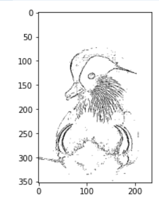

# Implement an Edge Detection project 

Work through the following steps for creating an edge detection filter.

There is no test for this activity. You will just show your output images.

1. Implement the edge_detect function that accepts a filename of a jpeg
2. Use a 3x3 Edge Detection Kernel (you'll need to look up what your kernel should look like for this)
3. Use for-loops and numpy code to do the convolution to each RGB channel of the image
6. Convert to logic min/max and set to values to 0 or 255, nothing in between (>127 is 255)
5. Show result and save to a file
6. Bonus: convert to grayscale and set to values to 0 or 255, nothing in between
7. Display the b&w image in grayscale and save to a file

Consider making a generic kernel application method.

Raise your paddlepop when you have your output image to get checked off.

Your ouptut image should look something like the following if you converted it to grayscale:

